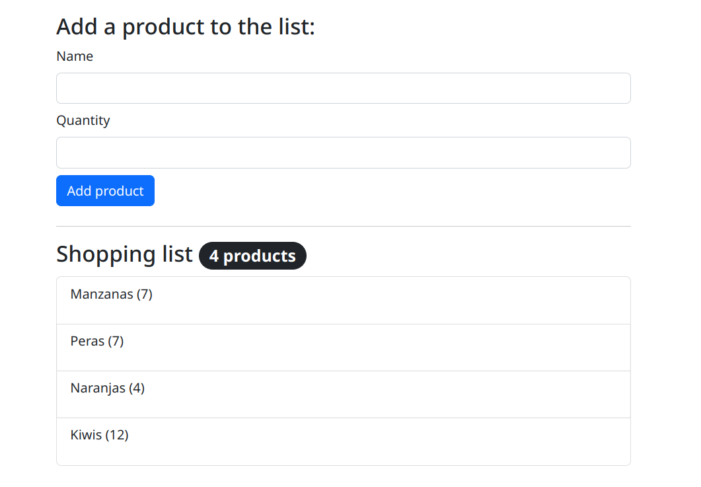

# Shopping list



## Backend

### Run manually

#### Install dependencies and virtual environment

```bash
pipenv install
```

Open the installed virtualenv with:

```bash
pipenv shell
```

#### Run database migrations

```bash
./manage.py migrate
```

#### Create super user

```bash
./manage.py createsuperuser
```

Select a name and password for the super user.

#### Run the server

Inside the Python virtual env:

```bash
./manage.py runserver
```

Go to [http://localhost:8000/](http://localhost:8000/).

### Run with docker

#### Build docker image

```bash
docker build . -t shopping-list
```

#### Run the docker image

```bash
docker run -p 8000:8000 -it shopping-list:latest
```

### Admin panel

Go to [http://localhost:8000/admin/](http://localhost:8000/admin/) and use your super user credentials to see the admin panel.

You can manually add/edit/remove products from here.

## Frontend

### Available Scripts

In the project directory, you can run:

#### `npm start`

Runs the app in the development mode.\
Open [http://localhost:3000](http://localhost:3000) to view it in your browser.

The page will reload when you make changes.\
You may also see any lint errors in the console.

#### `npm run build`

Builds the app for production to the `build` folder.\
It correctly bundles React in production mode and optimizes the build for the best performance.

The build is minified and the filenames include the hashes.\
Your app is ready to be deployed!

See the section about [deployment](https://facebook.github.io/create-react-app/docs/deployment) for more information.
